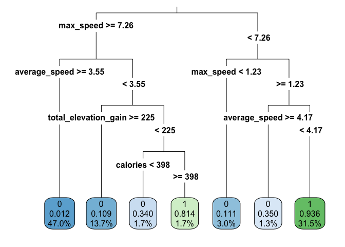

Análisis de deportes de resistencia
================

Cargamos librerias y los datos

``` r
library(plyr)
library(ggplot2)
library(tidyverse)
```

    ## ── Attaching packages ─────────────────────────────────────── tidyverse 1.3.1 ──

    ## ✓ tibble  3.1.2     ✓ dplyr   1.0.7
    ## ✓ tidyr   1.1.3     ✓ stringr 1.4.0
    ## ✓ readr   1.4.0     ✓ forcats 0.5.1
    ## ✓ purrr   0.3.4

    ## ── Conflicts ────────────────────────────────────────── tidyverse_conflicts() ──
    ## x dplyr::arrange()   masks plyr::arrange()
    ## x purrr::compact()   masks plyr::compact()
    ## x dplyr::count()     masks plyr::count()
    ## x dplyr::failwith()  masks plyr::failwith()
    ## x dplyr::filter()    masks stats::filter()
    ## x dplyr::id()        masks plyr::id()
    ## x dplyr::lag()       masks stats::lag()
    ## x dplyr::mutate()    masks plyr::mutate()
    ## x dplyr::rename()    masks plyr::rename()
    ## x dplyr::summarise() masks plyr::summarise()
    ## x dplyr::summarize() masks plyr::summarize()

``` r
library(tidymodels)
```

    ## Registered S3 method overwritten by 'tune':
    ##   method                   from   
    ##   required_pkgs.model_spec parsnip

    ## ── Attaching packages ────────────────────────────────────── tidymodels 0.1.3 ──

    ## ✓ broom        0.7.7      ✓ rsample      0.1.0 
    ## ✓ dials        0.0.9      ✓ tune         0.1.5 
    ## ✓ infer        0.5.4      ✓ workflows    0.2.2 
    ## ✓ modeldata    0.1.0      ✓ workflowsets 0.0.2 
    ## ✓ parsnip      0.1.6      ✓ yardstick    0.0.8 
    ## ✓ recipes      0.1.16

    ## ── Conflicts ───────────────────────────────────────── tidymodels_conflicts() ──
    ## x dplyr::arrange()   masks plyr::arrange()
    ## x purrr::compact()   masks plyr::compact()
    ## x dplyr::count()     masks plyr::count()
    ## x scales::discard()  masks purrr::discard()
    ## x dplyr::failwith()  masks plyr::failwith()
    ## x dplyr::filter()    masks stats::filter()
    ## x recipes::fixed()   masks stringr::fixed()
    ## x dplyr::id()        masks plyr::id()
    ## x dplyr::lag()       masks stats::lag()
    ## x dplyr::mutate()    masks plyr::mutate()
    ## x dplyr::rename()    masks plyr::rename()
    ## x yardstick::spec()  masks readr::spec()
    ## x recipes::step()    masks stats::step()
    ## x dplyr::summarise() masks plyr::summarise()
    ## x dplyr::summarize() masks plyr::summarize()
    ## • Use tidymodels_prefer() to resolve common conflicts.

``` r
library(discrim)
```

    ## 
    ## Attaching package: 'discrim'

    ## The following object is masked from 'package:dials':
    ## 
    ##     smoothness

``` r
library(caret)
```

    ## Loading required package: lattice

    ## 
    ## Attaching package: 'caret'

    ## The following objects are masked from 'package:yardstick':
    ## 
    ##     precision, recall, sensitivity, specificity

    ## The following object is masked from 'package:purrr':
    ## 
    ##     lift

``` r
library(pROC)
```

    ## Type 'citation("pROC")' for a citation.

    ## 
    ## Attaching package: 'pROC'

    ## The following objects are masked from 'package:stats':
    ## 
    ##     cov, smooth, var

``` r
library(rpart)
```

    ## 
    ## Attaching package: 'rpart'

    ## The following object is masked from 'package:dials':
    ## 
    ##     prune

``` r
library(rattle)
```

    ## Loading required package: bitops

    ## Rattle: A free graphical interface for data science with R.
    ## Version 5.4.0 Copyright (c) 2006-2020 Togaware Pty Ltd.
    ## Type 'rattle()' to shake, rattle, and roll your data.

``` r
library(rpart.plot)
library(e1071)
```

    ## 
    ## Attaching package: 'e1071'

    ## The following object is masked from 'package:tune':
    ## 
    ##     tune

    ## The following object is masked from 'package:rsample':
    ## 
    ##     permutations

``` r
library(class)
library(naivebayes)
```

    ## naivebayes 0.9.7 loaded

``` r
library(psych)
```

    ## 
    ## Attaching package: 'psych'

    ## The following objects are masked from 'package:scales':
    ## 
    ##     alpha, rescale

    ## The following objects are masked from 'package:ggplot2':
    ## 
    ##     %+%, alpha

``` r
bici3<-read_rds("/Users/gabrielengel/Downloads/endurance.rds")
```

**Limpieza de datos**.

Lo primero que se necesita hacer al inspeccionar los datos es encontrar
la variable decisiva para el análisis. Como se pide diferenciar las
actividades realizadas en bicicletas o a pie, se usa la variable *type*.
Las agrupamos y creamos los dos tipos de *type*, y para poder correr los
modelos, denominamos las actividades realizadas en bicicleta con un 0 y
los que se realizan a pie con un 1.

``` r
str(bici3)
```

    ## 'data.frame':    167615 obs. of  16 variables:
    ##  $ id                  : int  1 2 3 4 5 6 7 8 9 10 ...
    ##  $ type                : chr  "Ride" "Ride" "Ride" "Ride" ...
    ##  $ athlete             : num  13279977 13279977 13279977 13279977 13279977 ...
    ##  $ calories            : num  521 538 742 314 696 ...
    ##  $ distance            : num  13130 12939 17516 7931 17073 ...
    ##  $ elev_low            : chr  "337.3" "338.5" "301.6" "339.2" ...
    ##  $ records             : chr  "0" "1" "0" "0" ...
    ##  $ elev_high           : chr  "375.6" "477" "377" "389.7" ...
    ##  $ max_speed           : chr  "10.5" "11.4" "11.6" "10.2" ...
    ##  $ device_name         : chr  "Strava iPhone App" "Strava iPhone App" "Strava iPhone App" "Strava iPhone App" ...
    ##  $ moving_time         : num  3908 3791 3837 2280 4188 ...
    ##  $ elapsed_time        : num  4326 4975 4510 2521 4473 ...
    ##  $ average_speed       : chr  "3.36" "3.413" "4.565" "3.479" ...
    ##  $ has_heartrate       : chr  "FALSE" "FALSE" "FALSE" "FALSE" ...
    ##  $ start_date_local    : POSIXct, format: "2015-10-25 07:33:45" "2015-10-23 06:44:01" ...
    ##  $ total_elevation_gain: num  206 288 309 156 269 ...

``` r
head(bici3)
```

    ##   id type  athlete calories distance elev_low records elev_high max_speed
    ## 1  1 Ride 13279977    520.9  13130.5    337.3       0     375.6      10.5
    ## 2  2 Ride 13279977    538.0  12938.7    338.5       1       477      11.4
    ## 3  3 Ride 13279977    741.6  17515.7    301.6       0       377      11.6
    ## 4  4 Ride 13279977    314.5   7931.4    339.2       0     389.7      10.2
    ## 5  5 Ride 13279977    696.5  17072.7    336.2       1     389.4      14.2
    ## 6  6 Ride 13279977    109.1   3195.0    333.6       0     369.1       6.8
    ##         device_name moving_time elapsed_time average_speed has_heartrate
    ## 1 Strava iPhone App        3908         4326          3.36         FALSE
    ## 2 Strava iPhone App        3791         4975         3.413         FALSE
    ## 3 Strava iPhone App        3837         4510         4.565         FALSE
    ## 4 Strava iPhone App        2280         2521         3.479         FALSE
    ## 5 Strava iPhone App        4188         4473         4.077         FALSE
    ## 6 Strava iPhone App        1237         4166         2.583         FALSE
    ##      start_date_local total_elevation_gain
    ## 1 2015-10-25 07:33:45                206.0
    ## 2 2015-10-23 06:44:01                287.9
    ## 3 2015-10-20 06:04:18                309.1
    ## 4 2015-10-17 18:49:55                156.4
    ## 5 2015-09-06 07:00:39                268.8
    ## 6 2015-09-05 09:34:14                 36.3

``` r
summary(bici3)
```

    ##        id             type              athlete            calories       
    ##  Min.   :     1   Length:167615      Min.   : 8558143   Min.   :     0.0  
    ##  1st Qu.: 41904   Class :character   1st Qu.:14204866   1st Qu.:   281.0  
    ##  Median : 83808   Mode  :character   Median :15621719   Median :   629.0  
    ##  Mean   : 83808                      Mean   :15359426   Mean   :   816.7  
    ##  3rd Qu.:125712                      3rd Qu.:16685446   3rd Qu.:  1076.8  
    ##  Max.   :167615                      Max.   :18078075   Max.   :326157.3  
    ##     distance         elev_low           records           elev_high        
    ##  Min.   :      0   Length:167615      Length:167615      Length:167615     
    ##  1st Qu.:   6159   Class :character   Class :character   Class :character  
    ##  Median :  12968   Mode  :character   Mode  :character   Mode  :character  
    ##  Mean   :  21998                                                           
    ##  3rd Qu.:  27494                                                           
    ##  Max.   :1479320                                                           
    ##   max_speed         device_name         moving_time        elapsed_time      
    ##  Length:167615      Length:167615      Min.   :       0   Min.   :        0  
    ##  Class :character   Class :character   1st Qu.:    2248   1st Qu.:     2582  
    ##  Mode  :character   Mode  :character   Median :    3853   Median :     4450  
    ##                                        Mean   :    5141   Mean   :    32102  
    ##                                        3rd Qu.:    6516   3rd Qu.:     7934  
    ##                                        Max.   :11025474   Max.   :511111044  
    ##  average_speed      has_heartrate      start_date_local             
    ##  Length:167615      Length:167615      Min.   :1999-04-25 17:36:38  
    ##  Class :character   Class :character   1st Qu.:2016-11-23 17:11:10  
    ##  Mode  :character   Mode  :character   Median :2019-01-26 13:37:56  
    ##                                        Mean   :2018-05-12 07:50:32  
    ##                                        3rd Qu.:2020-04-30 04:33:10  
    ##                                        Max.   :2021-02-02 11:37:09  
    ##  total_elevation_gain
    ##  Min.   :    0.0     
    ##  1st Qu.:   15.1     
    ##  Median :  171.0     
    ##  Mean   :  397.0     
    ##  3rd Qu.:  595.0     
    ##  Max.   :59595.0

``` r
type <- bici3$type

table(type)
```

    ## type
    ## EBikeRide      Hike      Ride       Run      Walk 
    ##       587      2071    109536     51970      3451

``` r
#0 --> bici
#1 --> a pie
bici3$type[bici3$type=="EBikeRide"] <- "0"
bici3$type[bici3$type=="Ride"] <- "0"
bici3$type[bici3$type=="Hike"] <- "1"
bici3$type[bici3$type=="Run"] <- "1"
bici3$type[bici3$type=="Walk"] <- "1"
```

Ahora se decide qué variables tomar en consideración al correr los
modelos. Se eligen todas las variables que podrían ser importantes al
momento de decidir qué tipo de usuario es, tales como: calorías
quemadas, distancia, velocidad máxima y velocidad promedio dentro de los
que podrían tener más peso. Antes de separar las variables, primero se
limpian los datos para omitir los datos que faltan.

``` r
bici3 %>% 
  summarise_all(funs(sum(is.na(.))))
```

    ## Warning: `funs()` was deprecated in dplyr 0.8.0.
    ## Please use a list of either functions or lambdas: 
    ## 
    ##   # Simple named list: 
    ##   list(mean = mean, median = median)
    ## 
    ##   # Auto named with `tibble::lst()`: 
    ##   tibble::lst(mean, median)
    ## 
    ##   # Using lambdas
    ##   list(~ mean(., trim = .2), ~ median(., na.rm = TRUE))

    ##   id type athlete calories distance elev_low records elev_high max_speed
    ## 1  0    0       0        0        0    13519       0     13519         0
    ##   device_name moving_time elapsed_time average_speed has_heartrate
    ## 1        3502           0            0             0             0
    ##   start_date_local total_elevation_gain
    ## 1                0                    0

``` r
bici3 <- bici3 %>% filter(!(is.na(elev_low))) %>% filter(!(is.na(elev_high))) %>% filter(!(is.na(device_name)))

bici3 %>% 
  summarise_all(funs(sum(is.na(.))))
```

    ##   id type athlete calories distance elev_low records elev_high max_speed
    ## 1  0    0       0        0        0        0       0         0         0
    ##   device_name moving_time elapsed_time average_speed has_heartrate
    ## 1           0           0            0             0             0
    ##   start_date_local total_elevation_gain
    ## 1                0                    0

``` r
table(bici3$type)
```

    ## 
    ##     0     1 
    ## 99748 52242

``` r
bici3 <- bici3[,c(2, 4:6, 8:9, 11:13, 16)]
str(bici3)
```

    ## 'data.frame':    151990 obs. of  10 variables:
    ##  $ type                : chr  "0" "0" "0" "0" ...
    ##  $ calories            : num  521 538 742 314 696 ...
    ##  $ distance            : num  13130 12939 17516 7931 17073 ...
    ##  $ elev_low            : chr  "337.3" "338.5" "301.6" "339.2" ...
    ##  $ elev_high           : chr  "375.6" "477" "377" "389.7" ...
    ##  $ max_speed           : chr  "10.5" "11.4" "11.6" "10.2" ...
    ##  $ moving_time         : num  3908 3791 3837 2280 4188 ...
    ##  $ elapsed_time        : num  4326 4975 4510 2521 4473 ...
    ##  $ average_speed       : chr  "3.36" "3.413" "4.565" "3.479" ...
    ##  $ total_elevation_gain: num  206 288 309 156 269 ...

``` r
bici3$elev_low<- as.numeric(bici3$elev_low)
bici3$elev_high<- as.numeric(bici3$elev_high)
bici3$max_speed<- as.numeric(bici3$max_speed)
bici3$average_speed<- as.numeric(bici3$average_speed)

str(bici3)
```

    ## 'data.frame':    151990 obs. of  10 variables:
    ##  $ type                : chr  "0" "0" "0" "0" ...
    ##  $ calories            : num  521 538 742 314 696 ...
    ##  $ distance            : num  13130 12939 17516 7931 17073 ...
    ##  $ elev_low            : num  337 338 302 339 336 ...
    ##  $ elev_high           : num  376 477 377 390 389 ...
    ##  $ max_speed           : num  10.5 11.4 11.6 10.2 14.2 6.8 11.5 9.9 15.9 10.1 ...
    ##  $ moving_time         : num  3908 3791 3837 2280 4188 ...
    ##  $ elapsed_time        : num  4326 4975 4510 2521 4473 ...
    ##  $ average_speed       : num  3.36 3.41 4.57 3.48 4.08 ...
    ##  $ total_elevation_gain: num  206 288 309 156 269 ...

**Separación de datos - Training y Test**

``` r
set.seed(123)
data_split3 <- initial_split(bici3, prop = 0.8)
train_data3 <- training(data_split3) 
test_data3 <- testing(data_split3)
```

**Arbol de decisión**

Creamos el arbol de decisión usando los datos de training

``` r
m1<- rpart(type ~ ., data = train_data3, method = "class")
m1
```

    ## n= 121592 
    ## 
    ## node), split, n, loss, yval, (yprob)
    ##       * denotes terminal node
    ## 
    ##  1) root 121592 41720 0 (0.65688532 0.34311468)  
    ##    2) max_speed>=7.261 78029  4914 0 (0.93702341 0.06297659)  
    ##      4) average_speed>=3.5505 57196   701 0 (0.98774390 0.01225610) *
    ##      5) average_speed< 3.5505 20833  4213 0 (0.79777276 0.20222724)  
    ##       10) total_elevation_gain>=225.25 16654  1815 0 (0.89101717 0.10898283) *
    ##       11) total_elevation_gain< 225.25 4179  1781 1 (0.42617851 0.57382149)  
    ##         22) calories< 398.45 2121   722 0 (0.65959453 0.34040547) *
    ##         23) calories>=398.45 2058   382 1 (0.18561710 0.81438290) *
    ##    3) max_speed< 7.261 43563  6757 1 (0.15510869 0.84489131)  
    ##      6) max_speed< 1.231 3668   408 0 (0.88876772 0.11123228) *
    ##      7) max_speed>=1.231 39895  3497 1 (0.08765509 0.91234491)  
    ##       14) average_speed>=4.1745 1586   555 0 (0.65006305 0.34993695) *
    ##       15) average_speed< 4.1745 38309  2466 1 (0.06437130 0.93562870) *

``` r
rpart.plot(m1, type = 3, digits = 3, fallen.leaves = TRUE)
```

<!-- -->

Para predecir el tipo de usuario, se usan los datos de testing

``` r
pred_type3 <- predict(m1, newdata = test_data3, type = "class")
pred_type3 %>% as.data.frame() %>% head()
```

    ##    .
    ## 4  0
    ## 5  0
    ## 9  0
    ## 19 0
    ## 26 1
    ## 27 0

``` r
pred_type3 %>% as.data.frame() %>% tail()
```

    ##        .
    ## 151956 1
    ## 151958 1
    ## 151959 0
    ## 151961 1
    ## 151965 0
    ## 151967 1

``` r
test_data3$predictedtype <- pred_type3

pred_incom_roc <- predict(m1, newdata = test_data3, type = "prob")
pred_incom_roc %>% as.data.frame() %>% head()
```

    ##            0         1
    ## 4  0.6595945 0.3404055
    ## 5  0.9877439 0.0122561
    ## 9  0.9877439 0.0122561
    ## 19 0.9877439 0.0122561
    ## 26 0.1856171 0.8143829
    ## 27 0.9877439 0.0122561

``` r
pred_incom_roc %>% as.data.frame() %>% tail()
```

    ##                0         1
    ## 151956 0.0643713 0.9356287
    ## 151958 0.0643713 0.9356287
    ## 151959 0.9877439 0.0122561
    ## 151961 0.0643713 0.9356287
    ## 151965 0.9877439 0.0122561
    ## 151967 0.0643713 0.9356287

``` r
pred_incom_roc <- pred_incom_roc %>% as.data.frame()
prob <- pred_incom_roc$"1"

cm <- confusionMatrix(table(test_data3$type, test_data3$predictedtype))
test_data3$predictedtype <- as.factor(test_data3$predictedtype)


print(cm)
```

    ## Confusion Matrix and Statistics
    ## 
    ##    
    ##         0     1
    ##   0 19156   720
    ##   1  1105  9417
    ##                                           
    ##                Accuracy : 0.94            
    ##                  95% CI : (0.9372, 0.9426)
    ##     No Information Rate : 0.6665          
    ##     P-Value [Acc > NIR] : < 2.2e-16       
    ##                                           
    ##                   Kappa : 0.8662          
    ##                                           
    ##  Mcnemar's Test P-Value : < 2.2e-16       
    ##                                           
    ##             Sensitivity : 0.9455          
    ##             Specificity : 0.9290          
    ##          Pos Pred Value : 0.9638          
    ##          Neg Pred Value : 0.8950          
    ##              Prevalence : 0.6665          
    ##          Detection Rate : 0.6302          
    ##    Detection Prevalence : 0.6539          
    ##       Balanced Accuracy : 0.9372          
    ##                                           
    ##        'Positive' Class : 0               
    ## 

Al analizar el modelo, podemos ver que el accuracy del modelo es de
0,94. El “sensitivity”(0) es de 0,9456 mientras que el “specificity”(1)
es de 0,9290, lo que nos dice que el modelo se equivoca con casi la
misma probabilidad en ambos casos.

**Regrsión Logística**

Primero transformamos todas las variables a numéricas, y luego creamos
el modelo usando los datos de training

``` r
str(train_data3)
```

    ## 'data.frame':    121592 obs. of  10 variables:
    ##  $ type                : chr  "1" "0" "0" "0" ...
    ##  $ calories            : num  553 4478 76 618 2118 ...
    ##  $ distance            : num  15010 227882 3321 62772 59329 ...
    ##  $ elev_low            : num  600.2 -17.6 505.8 43.6 649.4 ...
    ##  $ elev_high           : num  701 790 538 95 1458 ...
    ##  $ max_speed           : num  5.6 18.5 12.6 10.3 15.6 ...
    ##  $ moving_time         : num  5436 31638 515 8662 13295 ...
    ##  $ elapsed_time        : num  5439 43512 548 9051 15896 ...
    ##  $ average_speed       : num  2.76 7.2 6.45 7.25 4.46 ...
    ##  $ total_elevation_gain: num  102 2367 35.4 103 1187 ...

``` r
train_data3$type<- as.numeric(train_data3$type)
rl<- glm(formula = type ~ .,data =  train_data3, family = "binomial" )
```

    ## Warning: glm.fit: algorithm did not converge

    ## Warning: glm.fit: fitted probabilities numerically 0 or 1 occurred

Ahora hacemos el predict con los datos de testing. Ya que las
predicciones que hace el modelo serán decimales entre 0-1, le tenemos
que decir que haga un “round” para que cualquier número igual o mayor a
0,5 se cambie a 1 y los que sean menor a 0,5 a 0.

``` r
p2<- predict(rl, newdata = test_data3, type = "response")
p_bici<- round(p2)

str(train_data3)
```

    ## 'data.frame':    121592 obs. of  10 variables:
    ##  $ type                : num  1 0 0 0 0 1 0 0 0 0 ...
    ##  $ calories            : num  553 4478 76 618 2118 ...
    ##  $ distance            : num  15010 227882 3321 62772 59329 ...
    ##  $ elev_low            : num  600.2 -17.6 505.8 43.6 649.4 ...
    ##  $ elev_high           : num  701 790 538 95 1458 ...
    ##  $ max_speed           : num  5.6 18.5 12.6 10.3 15.6 ...
    ##  $ moving_time         : num  5436 31638 515 8662 13295 ...
    ##  $ elapsed_time        : num  5439 43512 548 9051 15896 ...
    ##  $ average_speed       : num  2.76 7.2 6.45 7.25 4.46 ...
    ##  $ total_elevation_gain: num  102 2367 35.4 103 1187 ...

``` r
test_data3$type<- as.factor(test_data3$type)

length(p_bici)
```

    ## [1] 30398

``` r
length(test_data3$type)
```

    ## [1] 30398

``` r
p_bici<- as.factor(p_bici)
confusionMatrix(test_data3$type, p_bici)
```

    ## Confusion Matrix and Statistics
    ## 
    ##           Reference
    ## Prediction     0     1
    ##          0 18357  1519
    ##          1  1236  9286
    ##                                           
    ##                Accuracy : 0.9094          
    ##                  95% CI : (0.9061, 0.9126)
    ##     No Information Rate : 0.6445          
    ##     P-Value [Acc > NIR] : < 2.2e-16       
    ##                                           
    ##                   Kappa : 0.801           
    ##                                           
    ##  Mcnemar's Test P-Value : 7.759e-08       
    ##                                           
    ##             Sensitivity : 0.9369          
    ##             Specificity : 0.8594          
    ##          Pos Pred Value : 0.9236          
    ##          Neg Pred Value : 0.8825          
    ##              Prevalence : 0.6445          
    ##          Detection Rate : 0.6039          
    ##    Detection Prevalence : 0.6539          
    ##       Balanced Accuracy : 0.8982          
    ##                                           
    ##        'Positive' Class : 0               
    ## 

El accuracy del modelo es de 0,9094. El “sensitivity” y “specificity” es
de 0,9369 y 0,8594 respectivamente.

**Naive Bayes**

Creamos el modelo de naive bayes con los datos training. Luego generamos
las predicciones con los datos de testing.

``` r
train_data3$type<- as.factor(train_data3$type)
model_nb<- naive_bayes(type  ~  ., train_data3)
model_nb
```

    ## 
    ## ================================== Naive Bayes ================================== 
    ##  
    ##  Call: 
    ## naive_bayes.formula(formula = type ~ ., data = train_data3)
    ## 
    ## --------------------------------------------------------------------------------- 
    ##  
    ## Laplace smoothing: 0
    ## 
    ## --------------------------------------------------------------------------------- 
    ##  
    ##  A priori probabilities: 
    ## 
    ##         0         1 
    ## 0.6568853 0.3431147 
    ## 
    ## --------------------------------------------------------------------------------- 
    ##  
    ##  Tables: 
    ## 
    ## --------------------------------------------------------------------------------- 
    ##  ::: calories (Gaussian) 
    ## --------------------------------------------------------------------------------- 
    ##         
    ## calories         0         1
    ##     mean  889.2703  792.2556
    ##     sd   1471.5333  812.6145
    ## 
    ## --------------------------------------------------------------------------------- 
    ##  ::: distance (Gaussian) 
    ## --------------------------------------------------------------------------------- 
    ##         
    ## distance        0        1
    ##     mean 30171.02  9601.19
    ##     sd   31010.73  8266.55
    ## 
    ## --------------------------------------------------------------------------------- 
    ##  ::: elev_low (Gaussian) 
    ## --------------------------------------------------------------------------------- 
    ##         
    ## elev_low        0        1
    ##     mean 540.4894 596.9696
    ##     sd   395.1218 512.1765
    ## 
    ## --------------------------------------------------------------------------------- 
    ##  ::: elev_high (Gaussian) 
    ## --------------------------------------------------------------------------------- 
    ##          
    ## elev_high        0        1
    ##      mean 862.1793 838.3242
    ##      sd   637.8328 888.7517
    ## 
    ## --------------------------------------------------------------------------------- 
    ##  ::: max_speed (Gaussian) 
    ## --------------------------------------------------------------------------------- 
    ##          
    ## max_speed         0         1
    ##      mean 12.688117  5.264410
    ##      sd    4.894145  3.019553
    ## 
    ## ---------------------------------------------------------------------------------
    ## 
    ## # ... and 4 more tables
    ## 
    ## ---------------------------------------------------------------------------------

``` r
conf_nb<- predict(model_nb, test_data3)
```

    ## Warning: predict.naive_bayes(): more features in the newdata are provided as
    ## there are probability tables in the object. Calculation is performed based on
    ## features to be found in the tables.

``` r
confusionMatrix(test_data3$type, conf_nb)
```

    ## Confusion Matrix and Statistics
    ## 
    ##           Reference
    ## Prediction     0     1
    ##          0 10453  9423
    ##          1   437 10085
    ##                                           
    ##                Accuracy : 0.6756          
    ##                  95% CI : (0.6703, 0.6809)
    ##     No Information Rate : 0.6418          
    ##     P-Value [Acc > NIR] : < 2.2e-16       
    ##                                           
    ##                   Kappa : 0.4033          
    ##                                           
    ##  Mcnemar's Test P-Value : < 2.2e-16       
    ##                                           
    ##             Sensitivity : 0.9599          
    ##             Specificity : 0.5170          
    ##          Pos Pred Value : 0.5259          
    ##          Neg Pred Value : 0.9585          
    ##              Prevalence : 0.3582          
    ##          Detection Rate : 0.3439          
    ##    Detection Prevalence : 0.6539          
    ##       Balanced Accuracy : 0.7384          
    ##                                           
    ##        'Positive' Class : 0               
    ## 

El accuracy de este modelo es de 0,6756, lejos el peor de todos los
modelos. Su “sensitivity” y “specificity” son de 0,9599 y 0,5170
respectivamente.

**Comparación de modelos**

En este caso, el valor que debemos tomar en consideración es el
accuracy. El sensitivity y sensibility no son tan importantes para este
caso ya que al determinar erróneamente a un atleta que va a pie o en
bici no es de grave importancia como sería en otros casos. Un ejemplo
donde sería al revés son los tests PCR de Covid-19. En este caso, es
importante saber específicamente en qué tipo de error está cometiendo el
sistema. Es mucho más grave determinar a un paciente enfermo como sano
que a uno sano como enfermo, ya que el paciente enfermo se expone a otra
gente que podría contagiar, mientras que para un paciente sano con PCR
positivo, lo peor que le podría pasar es tener que hacer una cuarentena
de dos semanas.

El modelo que tiene mejor accuracy sería el de árbol de decisión(CART)
al tener 0,940.

Para identificar a aquellos actividades que fueron registradas
erróneamente revisamos la matriz de confusión del modelo, lo cual nos
dice que existen 1497 actividades realizadas a pie que fueron ingresados
como actividades en bicicleta, mientras que existen 690 ciclistas que
fueron registrados como actividades a pie.
